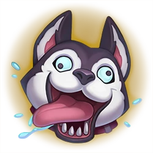

# uDog: League of Legends Summoner Negative Rating App

A Next.js application that lets you look up League of Legends summoners by name and assign “dog points” (negative ratings) to their profiles. Profiles are shared via human‑readable URLs and persisted in MongoDB, so everyone can see each summoner’s total dog points.

## Features

- Fetch summoner data from Riot’s API (name, icon, level) and account API (gameName#tagLine).
- Mongoose + MongoDB integration: store each looked-up summoner with their total dog points.
- Single downvote per session: lock voting after one dog point is given until a new search.
- Tailwind CSS for styling and Next/Image for optimized avatars.

## Demo



## Getting Started

### Prerequisites

- Node.js v16+ and npm/yarn/pnpm
- A MongoDB connection URI
- A Riot Games API key with access to Account and Summoner endpoints

### Environment Variables

Create a `.env.local` file in the project root with:

```dotenv
MONGODB_URI=<your MongoDB connection string>
RIOT_API_KEY=<your Riot Games API key>
```

### Install and Run

```bash
npm install           # or yarn / pnpm install
npm run dev           # start development server
npm run build         # build for production
npm start             # run production build
```

## Usage

1. Enter a Riot ID in the search box (e.g. `PlayerName#EUW`).
2. Press **Search** or hit Enter. The URL updates to `/player-name-euw`.
3. The summoner’s name, icon, level, and current dog points appear.
4. Click **Vote** to give one dog point (button locks until a new search).
5. Share the URL to let others view and downvote that profile.

## Project Structure

```
/public                 # Static assets (logo, icons)
src/app
  /api/summoner/route.ts   # API route: GET fetch & upsert summoner; POST increment dogPoints
  /components/
    SearchBar.tsx          # Search form, fetch logic, slug routing
    SummonerCard.tsx       # Profile card UI with icon, name, level, downvote
  layout.tsx               # App layout wrapper
  page.tsx                 # Home page (logo + SearchBar)
```

## API Endpoints

- `GET /api/summoner?name=GameName#Tag` – look up summoner by Riot ID, save to MongoDB, return profile data + dogPoints
- `POST /api/summoner` – body `{ puuid, increment }`; atomically update dogPoints and return new total

## Dependencies

- Next.js 13 (App Router)
- React & Tailwind CSS
- Mongoose (MongoDB ODM)
